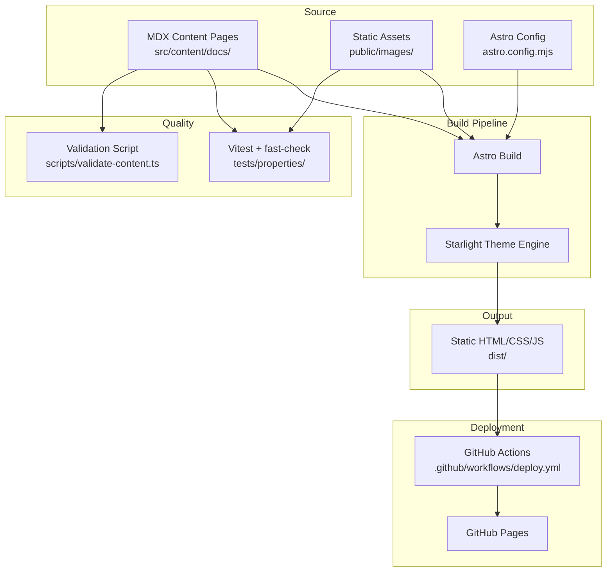

# Design Document: S3 Annotations Walkthrough

## Overview

This design describes an Astro Starlight documentation site that presents the [terraform-aws-s3-annotations-demo](https://github.com/jajera/terraform-aws-s3-annotations-demo) project as a structured, multi-page walkthrough. The site migrates content from the demo repository's `docs/walkthrough.md` and `README.md` into navigable MDX pages organized by topic.

The architecture is intentionally simple — a static site generator with content validation tooling. Astro compiles MDX pages into static HTML at build time, Starlight provides the documentation theme, sidebar navigation, and built-in search, and the site deploys to GitHub Pages via a GitHub Actions workflow.

Key design decisions:

- **Astro + Starlight** — zero-JS documentation sites with built-in search, sidebar, and theming
- **MDX over plain Markdown** — Starlight's default format; allows future component embedding
- **Property-based testing with fast-check** — validates content structure invariants across all pages
- **Single validation script** — wraps Prettier + markdownlint for a unified `validate` command
- **Dual-repository links** — demo repo in the header (`social`), docs repo for edit links
- **Shared slug manifest** — a single `REQUIRED_SLUGS` constant used by property tests and kept in sync with `astro.config.mjs`

## Requirements Traceability

| Requirement                 | Design section                                                                                                    |
| --------------------------- | ----------------------------------------------------------------------------------------------------------------- |
| 1 Project scaffolding       | [Project File Layout](#project-file-layout), [Astro Configuration](#astro-configuration-astroconfigmjs)           |
| 2 NPM scripts               | [Package Scripts](#package-scripts)                                                                               |
| 3 Content structure         | [Content Migration](#content-migration), [Landing Page](#landing-page-indexmdx)                                   |
| 4 Content page format       | [Content Page Format](#content-page-format)                                                                       |
| 5 Sidebar navigation        | [Astro Configuration](#astro-configuration-astroconfigmjs), [Sidebar Navigation Model](#sidebar-navigation-model) |
| 6 GitHub Actions deployment | [GitHub Actions Workflow](#github-actions-workflow-githubworkflowdeployyml)                                       |
| 7 Property-based testing    | [Correctness Properties](#correctness-properties), [Testing Strategy](#testing-strategy)                          |
| 8 Content validation script | [Validation Script](#validation-script-scriptsvalidate-contentts)                                                 |
| 9 Static assets             | [Static Assets](#static-assets), Property 6                                                                       |
| 10 Site configuration       | [Astro Configuration](#astro-configuration-astroconfigmjs)                                                        |

## Architecture



The site follows a straightforward static generation model:

1. **Content authoring** — MDX files in `src/content/docs/` contain the walkthrough content with YAML frontmatter
2. **Build** — Astro compiles MDX into static HTML, applying the Starlight theme, sidebar, and search index
3. **Validation** — Property tests and lint checks verify content quality before merge (locally and in CI)
4. **Deployment** — GitHub Actions builds and publishes to GitHub Pages on push to `main`

## Components and Interfaces

### Project File Layout

```text
s3-annotations-walkthrough/
├── .github/
│   └── workflows/
│       └── deploy.yml              # GitHub Actions deployment workflow
├── public/
│   ├── favicon.svg                 # Site favicon
│   └── images/
│       ├── architecture.png        # Pipeline architecture diagram
│       ├── namespaces.png          # Annotation namespaces diagram
│       └── webapp.png              # Gallery screenshot
├── scripts/
│   └── validate-content.ts        # Prettier + markdownlint validation
├── src/
│   ├── content/
│   │   ├── docs/
│   │   │   ├── index.mdx
│   │   │   ├── introduction/
│   │   │   │   └── what-are-s3-annotations.mdx
│   │   │   ├── architecture/
│   │   │   │   └── pipeline-overview.mdx
│   │   │   ├── deploy-and-operate/
│   │   │   │   └── prerequisites-apply-teardown.mdx
│   │   │   ├── pipeline-deep-dive/
│   │   │   │   ├── ingest-copy-and-annotate.mdx
│   │   │   │   ├── annotation-payload.mdx
│   │   │   │   ├── api-query-and-presign.mdx
│   │   │   │   └── optional-dynamodb-mirror.mdx
│   │   │   ├── gallery-and-presentation/
│   │   │   │   ├── amplify-gallery.mdx
│   │   │   │   └── presenter-script.mdx
│   │   │   └── reference/
│   │   │       └── demo-file-map.mdx
│   │   └── config.ts               # Content collection schema
│   └── env.d.ts                    # Astro type declarations
├── tests/
│   ├── properties/
│   │   ├── frontmatter.test.ts     # Property 1
│   │   ├── headings.test.ts        # Property 2
│   │   ├── code-blocks.test.ts     # Property 3
│   │   ├── slugs.test.ts           # Property 4
│   │   ├── content-body.test.ts    # Property 5
│   │   └── static-assets.test.ts   # Property 6
│   └── fixtures/
│       └── required-slugs.ts       # Shared slug manifest (sync with sidebar)
├── .gitignore
├── .markdownlint.json
├── .nvmrc                          # Node.js 22
├── .prettierrc
├── astro.config.mjs
├── package.json
├── tsconfig.json
└── vitest.config.ts
```

### Package Scripts

`package.json` scripts map directly to Requirement 2:

| Script     | Command                            | Purpose                        |
| ---------- | ---------------------------------- | ------------------------------ |
| `dev`      | `astro dev`                        | Local development server       |
| `build`    | `astro build`                      | Production build to `dist/`    |
| `preview`  | `astro preview`                    | Serve production build locally |
| `validate` | `tsx scripts/validate-content.ts`  | Prettier check + markdownlint  |
| `format`   | `prettier --write .`               | Auto-format all files          |
| `lint`     | `markdownlint-cli2 "src/**/*.mdx"` | Lint MDX content               |
| `test`     | `vitest --run`                     | Run property-based tests       |

Dependencies: `astro`, `@astrojs/starlight`, `vitest`, `fast-check`, `prettier`, `markdownlint-cli2`, `tsx` (to run the validation script).

### Astro Configuration (`astro.config.mjs`)

The configuration module is the central integration point:

```javascript
import { defineConfig } from "astro/config";
import starlight from "@astrojs/starlight";

export default defineConfig({
  site: "https://jajera.github.io",
  base: "/s3-annotations-walkthrough/",
  integrations: [
    starlight({
      title: "S3 Annotations Walkthrough",
      // Starlight search is enabled by default (Req 10.5)
      social: [
        {
          icon: "github",
          label: "Demo Source",
          href: "https://github.com/jajera/terraform-aws-s3-annotations-demo",
        },
      ],
      editLink: {
        baseUrl:
          "https://github.com/jajera/s3-annotations-walkthrough/edit/main/",
      },
      sidebar: [
        { label: "Home", slug: "index" },
        {
          label: "Introduction",
          items: [
            {
              label: "What are S3 Annotations?",
              slug: "introduction/what-are-s3-annotations",
            },
          ],
        },
        {
          label: "Architecture",
          items: [
            {
              label: "Pipeline overview",
              slug: "architecture/pipeline-overview",
            },
          ],
        },
        {
          label: "Deploy and Operate",
          items: [
            {
              label: "Prerequisites, apply, ingest, and teardown",
              slug: "deploy-and-operate/prerequisites-apply-teardown",
            },
          ],
        },
        {
          label: "Pipeline Deep Dive",
          items: [
            {
              label: "Ingest: copy and annotate",
              slug: "pipeline-deep-dive/ingest-copy-and-annotate",
            },
            {
              label: "Annotation payload",
              slug: "pipeline-deep-dive/annotation-payload",
            },
            {
              label: "API: query and presign",
              slug: "pipeline-deep-dive/api-query-and-presign",
            },
            {
              label: "Optional DynamoDB mirror",
              slug: "pipeline-deep-dive/optional-dynamodb-mirror",
            },
          ],
        },
        {
          label: "Gallery and Presentation",
          items: [
            {
              label: "Amplify gallery",
              slug: "gallery-and-presentation/amplify-gallery",
            },
            {
              label: "Presenter script",
              slug: "gallery-and-presentation/presenter-script",
            },
          ],
        },
        {
          label: "Reference",
          items: [
            {
              label: "Demo project file map",
              slug: "reference/demo-file-map",
            },
          ],
        },
      ],
    }),
  ],
});
```

Header link (Req 10.2): the `social` entry with label **Demo Source** points to the demo repository.

Edit links (Req 10.4): `editLink.baseUrl` points to this docs repository.

### Content Migration

Content is migrated from **Source_Material** in the demo repository. The table below is the authoritative mapping from source sections to target MDX files. During migration, preserve tables, CLI commands, JSON examples, and external links from each source section.

| Target MDX file                                       | Source section (`walkthrough.md`)         | Additional source (`README.md`)                                            |
| ----------------------------------------------------- | ----------------------------------------- | -------------------------------------------------------------------------- |
| `index.mdx`                                           | Opening paragraphs (lines 1–11)           | —                                                                          |
| `introduction/what-are-s3-annotations.mdx`            | §1 The S3 Annotations story               | —                                                                          |
| `architecture/pipeline-overview.mdx`                  | §2 Architecture                           | Architecture summary                                                       |
| `deploy-and-operate/prerequisites-apply-teardown.mdx` | §3 Deploy and operate                     | Prerequisites, scheduler, `deploy_amplify_on_apply`, teardown verification |
| `pipeline-deep-dive/ingest-copy-and-annotate.mdx`     | §4 Ingest: copy object + write annotation | —                                                                          |
| `pipeline-deep-dive/annotation-payload.mdx`           | §5 Annotation payload                     | —                                                                          |
| `pipeline-deep-dive/api-query-and-presign.mdx`        | §6 API: read annotations + presign images | —                                                                          |
| `pipeline-deep-dive/optional-dynamodb-mirror.mdx`     | §7 Optional DynamoDB mirror               | `enable_dynamodb` variable                                                 |
| `gallery-and-presentation/amplify-gallery.mdx`        | §8 Gallery (Amplify)                      | Manual `deploy-amplify.sh`                                                 |
| `gallery-and-presentation/presenter-script.mdx`       | §9 Presenter script                       | —                                                                          |
| `reference/demo-file-map.mdx`                         | §10 File reference + Build notes          | Sample images, pytest instructions                                         |

**Cross-page link updates:** internal anchor links in `walkthrough.md` (e.g. `#no-server-side-query`) become relative links between MDX pages (e.g. from API page to introduction page heading).

### Landing Page (`index.mdx`)

The landing page is not a sidebar group — it is the site root. Required content (Req 3.1):

- GeoNet open-data volcano camera demo context and Te Kaha (`TKAH.01`) camera
- Scope statement: metadata on the S3 object via annotations (in scope) vs production monitoring and advanced ML (out of scope)
- Link to [terraform-aws-s3-annotations-demo](https://github.com/jajera/terraform-aws-s3-annotations-demo)
- Card or list links to each major section (Introduction, Architecture, Deploy and Operate, Pipeline Deep Dive, Gallery and Presentation, Reference)

### Content Page Format

Each MDX page follows this structure:

```mdx
---
title: "Page Title"
description: "Brief description for SEO and metadata"
---

## First Section

Content body using Markdown with MDX extensions...
```

Constraints:

- Frontmatter MUST include `title` and `description` (both non-empty)
- Body headings start at level 2 (Starlight renders the title as h1)
- Fenced code blocks MUST specify a language identifier

**Code block language identifiers** (Req 4):

| Content type                      | Language identifier   |
| --------------------------------- | --------------------- |
| Shell commands                    | `bash` or `shell`     |
| Terraform                         | `hcl`                 |
| JSON examples                     | `json`                |
| Python examples                   | `python`              |
| Plain-text diagrams, key patterns | `text` or `plaintext` |

**Images** (Req 4.9, 9.4): use site-root-relative paths so Astro's `base` config applies the GitHub Pages prefix automatically:

```mdx

```

Write `/images/...` in MDX — Astro resolves this to `/s3-annotations-walkthrough/images/...` in production. Do not hardcode the full base path in every image reference.

| Image file         | Used on page                               | Alt text (from source)                                                                                  |
| ------------------ | ------------------------------------------ | ------------------------------------------------------------------------------------------------------- |
| `architecture.png` | `architecture/pipeline-overview`           | S3 Annotations demo architecture — GeoNet ingest, private S3 with annotations, API, and Amplify gallery |
| `namespaces.png`   | `introduction/what-are-s3-annotations`     | S3 object with annotation namespaces — demo uses environment with JSON payload                          |
| `webapp.png`       | `gallery-and-presentation/amplify-gallery` | S3 Annotations demo gallery — filters, result count, Te Kaha camera images with annotation tag chips    |

### Static Assets

Images are copied from `terraform-aws-s3-annotations-demo/docs/` into `public/images/` during initial setup:

```bash
cp ../terraform-aws-s3-annotations-demo/docs/{architecture,namespaces,webapp}.png public/images/
```

> **Note:** The demo repository references these PNGs in `walkthrough.md` but they may not be present in every clone. If missing, obtain them from the demo maintainer or regenerate screenshots before migration.

The favicon (`public/favicon.svg`) is created for this docs site and is not sourced from the demo.

### Validation Script (`scripts/validate-content.ts`)

```typescript
// Runs two checks sequentially:
// 1. prettier --check .
// 2. markdownlint-cli2 "src/**/*.mdx"
// Exits non-zero if either fails, reporting which check(s) failed.
// Exits 0 if all checks pass.
```

The script uses Node.js `child_process.execSync` to invoke each tool and collects results before reporting.

### GitHub Actions Workflow (`.github/workflows/deploy.yml`)

Follows the [official Astro GitHub Pages pattern](https://docs.astro.build/en/guides/deploy/github/). `withastro/action` handles checkout, Node install, `npm ci`, build, and artifact upload — do not duplicate `setup-node` / `npm ci` before it.

```yaml
name: Deploy to GitHub Pages

on:
  push:
    branches: [main]
  workflow_dispatch:

concurrency:
  group: pages
  cancel-in-progress: false

permissions:
  contents: read
  pages: write
  id-token: write

jobs:
  build:
    runs-on: ubuntu-latest
    steps:
      - name: Checkout
        uses: actions/checkout@v4
      - name: Validate and test
        run: |
          npm ci
          npm run validate
          npm run test
      - name: Install, build, and upload site
        uses: withastro/action@v3
        with:
          node-version: "22" # matches .nvmrc (Req 1.3)

  deploy:
    needs: build
    runs-on: ubuntu-latest
    environment:
      name: github-pages
      url: ${{ steps.deployment.outputs.page_url }}
    steps:
      - name: Deploy to GitHub Pages
        id: deployment
        uses: actions/deploy-pages@v4
```

Design notes:

- **Validate + test before build** — not explicitly required by Req 6, but prevents deploying broken content. The `withastro/action` step runs a second `npm ci` + build; this is expected.
- **Node 22** — passed explicitly to `withastro/action` because the action defaults to a newer Node version.
- **Fail closed** — if validate, test, or build fails, the `deploy` job is skipped via `needs: build` (Req 6.5).

## Data Models

### Content Collection Schema

Astro content collections use Zod schemas to validate frontmatter at build time:

```typescript
// src/content/config.ts
import { defineCollection, z } from "astro:content";
import { docsSchema } from "@astrojs/starlight/schema";

export const collections = {
  docs: defineCollection({
    schema: docsSchema({
      extend: z.object({
        description: z.string().min(1),
      }),
    }),
  }),
};
```

Starlight's default `docsSchema()` treats `description` as optional. The extended schema makes it required at build time, complementing Property 1 in tests.

### Sidebar Navigation Model

The sidebar is a tree structure:

```typescript
type SidebarItem =
  | { label: string; slug: string } // Leaf page
  | { label: string; items: SidebarItem[] }; // Group
```

The sidebar configuration is static — defined in `astro.config.mjs`. Property tests validate every slug against the filesystem using a shared manifest:

```typescript
// tests/fixtures/required-slugs.ts
export const REQUIRED_SLUGS = [
  "index",
  "introduction/what-are-s3-annotations",
  "architecture/pipeline-overview",
  "deploy-and-operate/prerequisites-apply-teardown",
  "pipeline-deep-dive/ingest-copy-and-annotate",
  "pipeline-deep-dive/annotation-payload",
  "pipeline-deep-dive/api-query-and-presign",
  "pipeline-deep-dive/optional-dynamodb-mirror",
  "gallery-and-presentation/amplify-gallery",
  "gallery-and-presentation/presenter-script",
  "reference/demo-file-map",
] as const;
```

When adding or renaming pages, update `astro.config.mjs`, `REQUIRED_SLUGS`, and the Requirement 5 table together.

### Page Slug to File Path Mapping

| Slug                                              | File Path                                                              |
| ------------------------------------------------- | ---------------------------------------------------------------------- |
| `index`                                           | `src/content/docs/index.mdx`                                           |
| `introduction/what-are-s3-annotations`            | `src/content/docs/introduction/what-are-s3-annotations.mdx`            |
| `architecture/pipeline-overview`                  | `src/content/docs/architecture/pipeline-overview.mdx`                  |
| `deploy-and-operate/prerequisites-apply-teardown` | `src/content/docs/deploy-and-operate/prerequisites-apply-teardown.mdx` |
| `pipeline-deep-dive/ingest-copy-and-annotate`     | `src/content/docs/pipeline-deep-dive/ingest-copy-and-annotate.mdx`     |
| `pipeline-deep-dive/annotation-payload`           | `src/content/docs/pipeline-deep-dive/annotation-payload.mdx`           |
| `pipeline-deep-dive/api-query-and-presign`        | `src/content/docs/pipeline-deep-dive/api-query-and-presign.mdx`        |
| `pipeline-deep-dive/optional-dynamodb-mirror`     | `src/content/docs/pipeline-deep-dive/optional-dynamodb-mirror.mdx`     |
| `gallery-and-presentation/amplify-gallery`        | `src/content/docs/gallery-and-presentation/amplify-gallery.mdx`        |
| `gallery-and-presentation/presenter-script`       | `src/content/docs/gallery-and-presentation/presenter-script.mdx`       |
| `reference/demo-file-map`                         | `src/content/docs/reference/demo-file-map.mdx`                         |

## Correctness Properties

_A property is a characteristic or behavior that should hold true across all valid executions of a system — essentially, a formal statement about what the system should do. Properties serve as the bridge between human-readable specifications and machine-verifiable correctness guarantees._

### Property 1: Frontmatter validity

_For any_ MDX content file in `src/content/docs/`, the file SHALL contain valid YAML frontmatter with both a non-empty `title` field and a non-empty `description` field.

**Validates: Requirements 4.1, 7.3**

### Property 2: Heading hierarchy validity

_For any_ MDX content file in `src/content/docs/`, all Markdown headings in the page body SHALL maintain a valid hierarchy — no heading level is skipped (e.g., an h2 followed by an h4 without an intervening h3 is invalid).

**Validates: Requirements 4.2, 7.4**

### Property 3: Code block language identifiers

_For any_ fenced code block in any MDX content file in `src/content/docs/`, the code block SHALL include a language identifier on the opening fence line.

**Validates: Requirements 4.3, 7.5**

### Property 4: Slug-to-file correspondence

_For any_ page slug in `REQUIRED_SLUGS`, a corresponding MDX file SHALL exist at `src/content/docs/{slug}.mdx`.

**Validates: Requirements 5.2, 7.6**

### Property 5: Non-empty page body

_For any_ slug in `REQUIRED_SLUGS`, the corresponding MDX file's content body (after frontmatter removal) SHALL be non-empty (contain at least one non-whitespace character).

**Validates: Requirements 3.14, 7.7**

### Property 6: Required static assets

_For any_ image file listed in the [Static Assets](#static-assets) table (`architecture.png`, `namespaces.png`, `webapp.png`), the file SHALL exist at `public/images/{filename}`.

**Validates: Requirements 9.3**

## Error Handling

### Build Errors

- **Missing frontmatter fields**: Extended `docsSchema` fails at build time if `title` or `description` is missing or empty.
- **Invalid MDX syntax**: Astro reports MDX parse errors with file path and line number during `astro build`.
- **Missing referenced images**: Broken image links result in 404s at runtime. Property 6 catches missing asset files; content review catches wrong paths.

### Validation Script Errors

The validation script (`scripts/validate-content.ts`) handles errors by:

1. Running Prettier in check mode — captures stdout/stderr, reports unformatted files
2. Running markdownlint-cli2 — captures lint violations with file paths and rule IDs
3. Reporting all failures with clear labels (`[prettier]` or `[markdownlint]`) before exiting with code 1

If a tool binary is not found (e.g., `prettier` not in PATH), the script fails fast with a descriptive error.

### Property Test Errors

- Property tests use `fast-check` with a minimum of 100 runs per property
- Since the input domain is the finite set of MDX files (or asset files), fast-check iterates over all of them
- On failure, fast-check reports the shrunk counterexample (the specific file and violation)
- Vitest exits with code 1 on any test failure

### Deployment Errors

- The GitHub Actions workflow uses `needs: build` — if validate, test, or build fails, deploy is skipped
- Permissions issues (missing `pages: write`) produce clear GitHub Actions error messages
- The workflow does not retry on failure; maintainers re-trigger manually via `workflow_dispatch` after fixing

## Testing Strategy

### Property-Based Tests (Vitest + fast-check)

Located in `tests/properties/`, these tests validate structural invariants across all content files.

**Library**: `fast-check` with Vitest integration
**Configuration**: Minimum 100 iterations per property (exhaustive over the finite file set)
**Tag format**: `Feature: s3-annotations-walkthrough, Property {N}: {description}`

| Test File               | Property   | What It Validates                                           |
| ----------------------- | ---------- | ----------------------------------------------------------- |
| `frontmatter.test.ts`   | Property 1 | All MDX files have title + description frontmatter          |
| `headings.test.ts`      | Property 2 | No skipped heading levels in any MDX file                   |
| `code-blocks.test.ts`   | Property 3 | All fenced code blocks have language identifiers            |
| `slugs.test.ts`         | Property 4 | Every slug in `REQUIRED_SLUGS` has a corresponding MDX file |
| `content-body.test.ts`  | Property 5 | No required content page has an empty body                  |
| `static-assets.test.ts` | Property 6 | All required images exist in `public/images/`               |

**Implementation approach**: Each test reads the filesystem to discover MDX files, uses `fast-check`'s `fc.constantFrom(...)` to sample from the file list, and asserts the property against each sampled file. With 100+ runs and a finite file set, this exhaustively covers all pages.

### Unit Tests

Minimal unit tests complement the property tests for specific edge cases:

- Validation script exits non-zero on intentionally malformatted content
- Validation script exits zero on properly formatted content

### Integration Tests

- `npm run build` produces output in `dist/` without errors
- `npm run validate` passes on committed content
- CI workflow runs validate + test + build on every push to `main`

### What Is NOT Tested

- Visual rendering (Starlight theme correctness) — manual review
- Link resolution at runtime (broken anchors between pages) — manual review during migration
- GitHub Actions workflow execution — verified by deployment itself
- Content accuracy vs Source_Material — manual review during migration; property tests verify structure only
